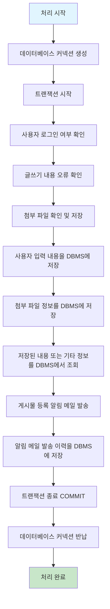
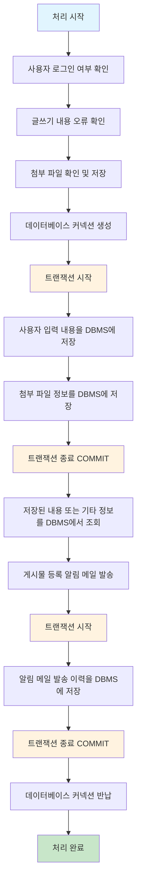

## 5.1 트랜잭션
### 5.1.1 MySQL에서의 트랜잭션
- 트랜잭션은 하나의 논리적인 작업 셋에 쿼리 개수와 관계없이논리적인 작업 셋자체가 100% 적용되거나 아무것도 적용되지 않아야 함을 보장해 주는 것이다. (원자성)
- 트랜잭션을 지원하지 않는 스토리지 엔진인 MyISAM, MEMORY와 다르게 InnoDB는 트랜잭션을 지원한다. 
- 트랜잭션을 지원하지 않아 발생하는 부분 업데이트로 인해 테이블 데이터의 정합성을 맞추기 어려워진다.
### 5.1.2 주의 사항
- 프로그램 코드에서 트랜잭션의 범위를 최소화 하는 것이 좋다.
- 사용자가 게시판에 게시물을 작성한 후 저장 버튼을 클릭했을 때 서버에서는 아래와 같이 처리될 것이다.

- 많은 개발자가 처리를 시작하는 시점에  커넥션 생성 및 트랜잭션 시작을 한다. 그리고 DBMS에 저장이 끝나면 COMMIT하고 커넥션을 종료한다. 하지만 실제로 DBMS에 데이터를 저장하는 작업(트랜잭션)은 `사용자 입력 내용을 DBMS에 저장` 할때부터 시작된다. 따라서 이 전의 작업은 아무리 빨리 처리된다 해도 트랜잭션에 포함시킬 필요가 없다.
- 일반적으로 데이터베이스 커넥션은 개수가 제한적이어서 각 단위 프로그램이 커넥션을 소유하는 시간이 길어질수록 사용 가능한 여유 커넥션의 개수는 줄어들 것이다.
- 특히 메일 전송 같은 네트워크를 통해 원격 서버와 통신하는 작업은 최대한 DBMS의 트랜잭션 내에서 제거하는 것이 좋다. 프로그램이 실행되는 동안 메일 서버와 통신할 수 없는 상황이 발생한다면 웹 서버뿐 아니라 DBMS 서버까지 위험해지는 상황이 발생할 것이기 때문이다.
- 위 플로우를 개선하면 아래와 같이 될 것이다.

