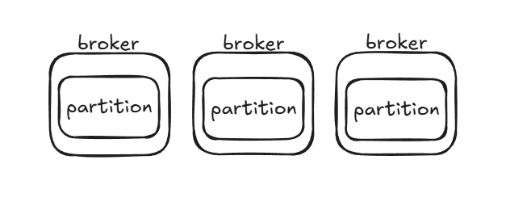

## 3.1 카프카 기초 다지기
### 3.1.1 리플리케이션
- 각 메시지들을 여러 개로 복제해서 카프카 클러스터 내 브로커들에 분산시키는 동작을 의미한다.
    - 덕분에 하나의 브로커가 종료되더라도 안정성을 유지할 수 있게 된다.
- 리플리케이션을 유지하기 위해서는 클러스터 생성 시 `replication-factor` 옵션을 활용하면 된다. 해당 옵션을 통해 토픽의 파티션을 리플리케이션한다.

`--partition 1, --replication-factor 3 `

 

- 리플리케이션 팩터 수가 커지면 안정성은 높아지지만 브로커 리소스를 많이 사용하게 되므로 복제에 대한 오버헤드를 줄이는 것이 중요하다.
- 아래와 같은 기준으로 리플리케이션 팩터 수를 설정한다면 효율적인 운영을 할 수 있다.
    - 테스트, 개발 환경 : 1
    - 운영 환경 (로그성 메세지로서 약간의 유실 허용) : 2
    - 운영 환경 (유실 허용하지 않음) : 3
### 3.1.2 파티션
- 하나의 토픽이 한 번에 처리할 수 있는 한계를 높이기 위해 토픽 하나를 여러 개로 나눠 병렬 처리가 가능하게 만든 것
    - 나눈 파티션 수 만큼 컨슈머를 연결시킬 수 있다.
- 토픽 당 파티션 수를 결정하는 기준이 다소 모호한 경우가 많다.
    - 공식도 간혹 있으나, 각 메시지 크기나 건수에 따라 다르므로 정확히 예측할 순 없다.
    - 파티션 수는 늘릴 수 있지만 절대로 줄일 순 없기 때문에 초기 파티션 수를 적게 하고(2 or 4) 메세지 처리량이나 컨슈머의 LAG등을 모니터링하면서 점차 늘려가야 한다.
- 컨슈머 LAG란 `프로듀서가 보낸 메세지 수(카프카에 남아 있는 메세지 수) - 컨슈머가 가져간 메세지 수` 를 나타낸다. 해당 지표를 통해 컨슈머의 지연 여부를 확인할 수 있다. 
### 3.1.3 세그먼트
- 프로듀서에 의해 브로커로 전송된 메시지는 토픽의 파티션에 저장되며, 각 메세지들은 세그먼트라는 로그 파일의 형태로 브로커의 로컬 디스크에 저장된다. 
- 각 파티션마다 N개의 세그먼트 로그 파일들이 존재한다. 
- 프로듀서가 카프카의 토픽으로 메세지를 전송하면 파티셔너를 통해 특정 파티션으로 전송이 되며, 이때 해당 파티션에 있는 세그먼트 로그 파일에 저장된다.
- 컨슈머는 토픽을 컨슘할 때 해당 토픽에 있는 파티션의 세그먼트 로그파일에서 메세지를 가져온다. 

