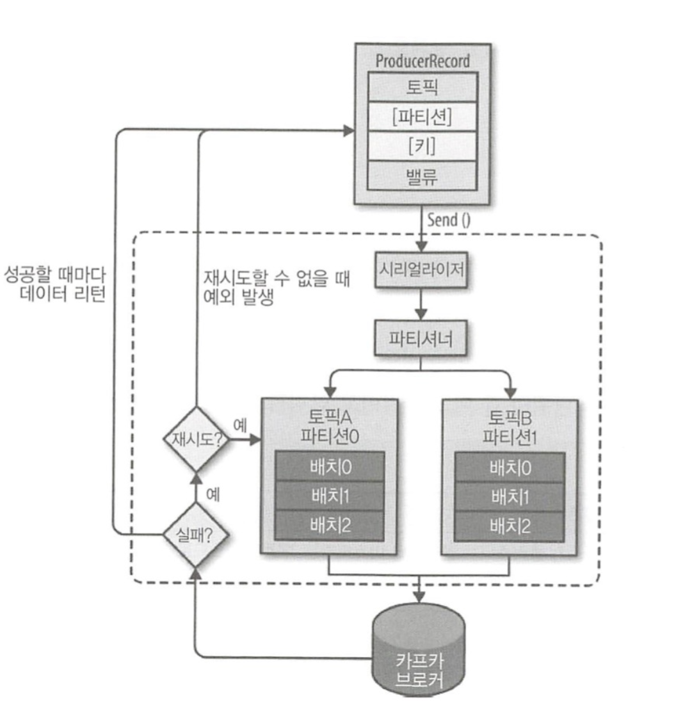

## 3.3 프로듀서의 기본 동작과 예제 맛보기
### 3.3.1 프로듀서 디자인

- `ProducerRecord`: 카프카로 전송하기 위한 실제 데이터.
    - 토픽과 밸류는 필수값이며, 특정 파티션을 지정하기 위한 레코드의 파티션과 특정 파티션에 레코드들을 정렬하기 위한 레코드의 키는 선택사항이다. 
- `send()`를 통해 시리얼라이저, 파티셔너를 거치게 된다. 
    - 파티션을 지정한 경우, 파티셔너는 아무 동작도 하지 않고 지정된 파티션으로 레코드를 전달한다. 지정이 안되어 있는 경우에는 키를 가지고 파티션을 선택해 레코드를 전달한다. (Default는 라운드 로빈 방식)
- 레코드들을 파티션별로 잠시 모아두고 전송 (배치 전송을 위해)
- 전송 실패 시 재시도. 재시도도 실패하면 최종 실패를 전달. 전송 성공시 메타데이터를 리턴한다.

### 3.3.2 프로듀서의 주요 옵션
| 프로듀서 옵션 | 설명 |
| --- | --- |
| `bootstrap.servers` | 카프카 클러스터는 클러스터 마스터라는 개념이 없으므로, 클러스터 내 모든 서버가 클라이언트의 요청을 받을 수 있다. 클라이언트가 카프카 클러스터에 처음 연결하기 위한 호스트와 포트 정보를 나타낸다.  |
| `client.dns.lookup` | 하나의 호스트에 여러 IP를 매핑해 사용하는 일부 환경에서 클라이언트가 하나의 IP와 연결하지 못할 경우에 다른 IP로 시도하는 설정이다. `user_all_dns_ips` 가 기본값으로, DNS에 할당된 호스트의 모든 IP를 쿼리하고 저장한다. 첫 번째 IP 접근이 실패하면, 종료하지 않고 다음 IP로 접근을 시도한다.  |
| `acks` | 카프카 토픽의 리더 측에 메시지를 전송한 후 요청을 완료하기를 결정하는 옵션   - **0** : 프로듀서는 브로커의 응답을 기다리지 않고 전송 즉시 완료된것으로 취급된다. 따라서 실제로 잘 받았는지에 대해서는 보장할 수 없다.(retries 설정도 적용이 안됨) → **높은 처리율이 필요하면서, 데이터가 유실되어도 큰 문제 없을 때 고려**   - **1** : 리더는 메세지를 받으면 바로 프로듀서에게 확인 응답을 한다. 이때, 팔로워들에게 복제가 완료됐다는 확인을 기다리지 않고 바로 수신됐다고 응답하므로 **리더가 수신확인했다고 응답하고 난 직후 리더에 장애가 발생했을 경우, 팔로워들에게 레코드가 복제되지 않았다면 메세지 유실이 일어날 수 있다**.   - **all(-1)** : 리더는 모든 **동기화된 복제본이(ISR) 레코드를 수신확인할 때 까지 기다린 다음, 수신됐다고 응답**하므로 레코드 유실이 안된다. |
| `buffer.memory`  | 프로듀서가 카프카 서버로 데이터를 보내기 위해 잠시 대기할 수 있는 전체 메모리 바이트 |
| `compression.type` | 프로듀서가 메세지 전송 시 선택할 수 있는 압축 타입  |
| `enable.idempotence` | true로 둘 시, 중복 없는 전송이 가능. 이때 max.in.flight.requests.per.connection은 5 이하, retries는 0이상, acks는 all로 설정해야 함 |
| `max.in.flight.requests.per.connection` | 하나의 커넥션에서 프로듀서가 최대한 브로커로부터 **응답(**ACK) 없이 전송할 수 있는 요청 수   - 5 이하로 설정하면, 프로듀서는 하나의 요청이 실패했을 때 후속 요청들의 전송을 잠시 멈추고 재시도를 진행하여 순서가 꼬이는 문제를 방지할 수 있다.  |
| `retries` | 일시적인 오류로 인해 전송에 실패한 데이터를 다시 보내는 횟수 |
| `batch.size` | 프로듀서는 동일한 파티션으로 보내는 여러 데이터를 함께 배치로 보낼 때의 크기 |
| `linger.ms` | 배치 형태의 메시지를 보내기 전 대기 시간 |
| `transactional.id` | “정확히 한 번 전송”을 위해 사용하는 옵션이며, 동일한 TransactionalId에 한해 정확히 한 번을 보장. 옵션을 사용하기 전 enable.idempotence를 true로 설정해야 함 |
