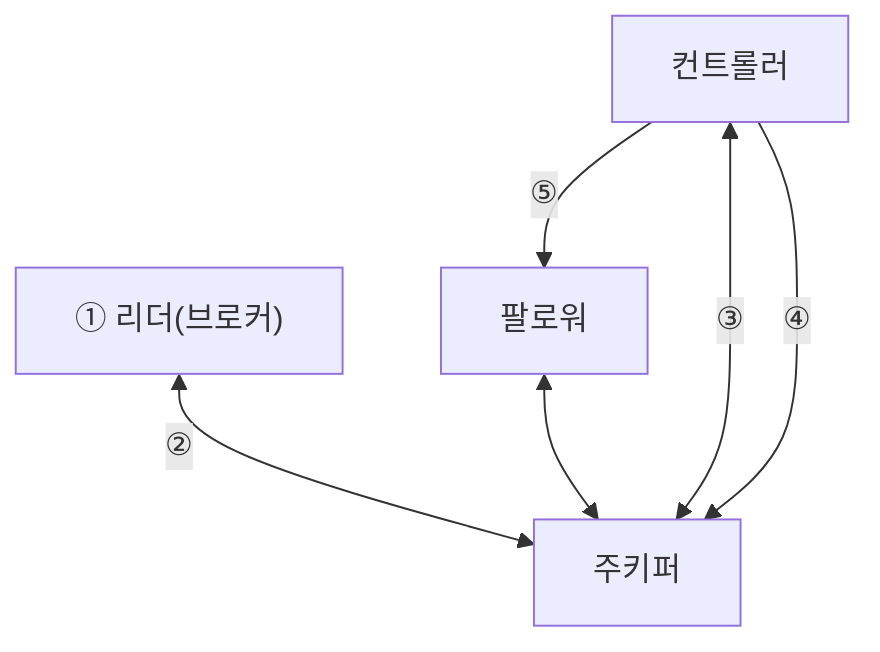
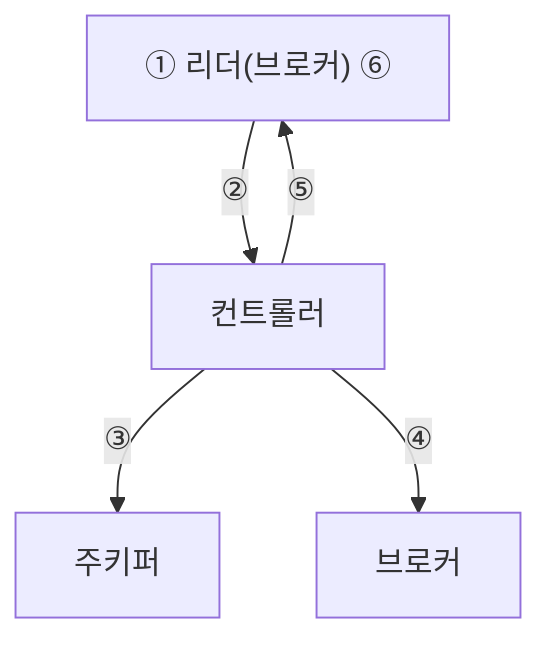

## 4.2 컨트롤러
- 카프카 클러스터 중 하나의 브로커가 컨트롤러 역할을 하게 되며, 파티션의 ISR 리스트 중에서 리더를 선출한다.
    - 리더를 선출하기 위한 ISR 정보는 가용성 보장을 위해 주키퍼에 저장된다. (Kraft 모드의 경우 메타데이터 로그 파티션에 저장됨)
- 컨트롤러는 브로커의 실패여부를 감시하며, 실패가 감지되었을 경우 즉시 ISR 리스트 중 하나를 새로운 파티션 리더로 선출한다.
    - 그 후 새로운 리더의 정보를 기록 후 변경된 정보를 모든 브로커에게 전달한다.
### 예기치 못한 브로커 장애로 인한 리더 선출 방법
| 토픽 | peter-test02 |
| --- | --- |
| 파티션 수 | 1 |
| 리플리케이션 팩터 수 | 2 |
| 브로커 배치 | 1, 3번 브로커 |
| 현재 리더 위치 | 1번 브로커 |

1. 파티션 0번의 리더가 있는 브로커 1번 다운
2. 주키퍼는 1번 브로커와 연결이 끊어진 후, 0번 파티션의 ISR에서 변화가 생겼음을 감지
3. 컨트롤러는 주키퍼 위치를 통해 0번 파티션에 변화가 생긴 것을 감지하고, 해당 파티션 ISR중 3번을 새로운 리더로 선출
4. 컨트롤러는 0번 파티션의 새로운 리더가 3이라는 정보를 주키퍼에 기록
5. 갱신된 정보는 현재 활성화 상태인 모든 브로커에게 전파됨

- 컨트롤러가 새 리더를 선출하고 리더 정보를 주키퍼에 기록하면 다른 브로커에게 전파해야하는데, 파티션이 엄청 많다면 매우 오랜 시간이 걸리게 된다.
    - 한개의 파티션에 대해 0.2초가 걸릴 경우, 파티션이 1만개라면 2000초 (30분)

- 이는 카프카 버전 1.1.0부터 개선되었다.
    - 비동기 API 도입 : 컨트롤러가 ZooKeeper에 파티션 리더 정보를 기록할 때, 이전에는 하나씩 동기적으로 처리해서 느렸다. 하지만 1.1.0부터는 비동기 API를 사용해서 여러 파티션 정보를 동시에 처리할 수 있게 되었고, 덕분에 제어된 종료 시간이 6.5분에서 3초로, 컨트롤러 재시작 시간도 28초에서 14초로 크게 단축되었다.
    - 배치 처리 도입 : 새로운 리더 정보를 다른 브로커들에게 전달할 때도, 이전에는 파티션마다 개별 요청을 보냈지만, 이제는 하나의 배치 요청으로 모든 관련 파티션 정보를 한 번에 보낼 수 있게 되었다.
    - 이러한 개선점을 통해 클러스터당 최대 20만 개의 파티션을 지원할 수 있게 됨

### 제어된 종료 과정에서의 리더 선출 작업

1. 관리자가 브로커 종료 명령어를 실행하고, SIG_TERM 신호가 브로커에게 전달된다
2. SIG_TERM 신호를 받은 브로커는 컨트롤러에게 알린다
3. 컨트롤러는 리더 선출 작업을 진행하고, 해당 정보를 주키퍼에 기록한다
4. 컨트롤러는 새로운 리더 정보를 다른 브로커들에게 전송한다
5. 컨트롤러는 종료 요청을 보낸 브로커에게 정상 종료한다는 응답을 보낸다
6. 응답을 받은 브로커는 캐시에 있는 내용을 디스크에 저장하고 종료한다

- 제어된 종료와 급작스러운 종료의 가장 큰 차이는 다운타임이다. 
    - 제어된 종료를 사용하면 브로커가 종료되기 전, 컨트롤러는 해당 브로커가 리더로 할당된 전체 파티션에 대해 리더 선출 작업을  리더들이 활성화된 상태에서 순차적으로 하나의 파티션마다 진행하기 때문에 내부적으로 다운타임을 최소화 할 수 있다.
    - 반면에 브로커 장애로 인한 리더 선출은 이미 대상 파티션들의 리더가 종료된 상태이고, 파티션들의 다운타임은 새로운 리더 선출 작업이 될 때까지 지속된다. 이때 컨트롤러는 순차적으로 하나의 파티션마다 리더를 선출하므로 첫번째 대상 파티션의 다운타임은 길지 않지만 마지막 대상 파티션의 다운타임은 오랜 시간이 걸린다. 
- 제어된 종료를 사용하려면 `controlled.shutdown.enable=true` 설정이 브로커의 설정인 server.properties에 적용되어야 한다.

