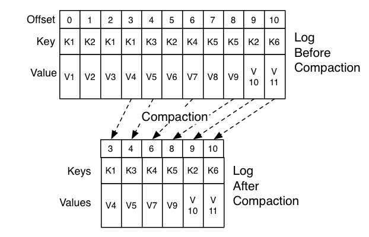

## 4.3 로그(로그 세그먼트)
- 카프카의 토픽으로 들어오는 메시지는 세그먼트(로그 세그먼트)라는 파일에 정해진 형식에 맞추어 순차적으로 저장된다.
- 로그 세그먼트에는 메시지의 내용만 저장되는 것이 아니라 메시지의 키, 밸류, 오프셋, 메시지 크기 같은 정보가 함께 저장되며, 로그 세그먼트 파일들은 브로커의 로컬 디스크에 보관된다. 
- 로그 세그먼트 크기가 너무 커져버리면 파일 관리가 어려우므로 로그 세그먼트의 최대 크기는 1GB가 기본값으로 설정되어 있다.
    - 로그 세그먼트가 1GB보다 커지는 경우에는 기본적으로 롤링 전략을 사용한다.
- 1GB 크기의 로그 세그먼트 파일이 무한히 늘어날 경우를 대비해 로그 세그먼트에 대한 관리 계획을 수립해둬야 한다.

### 4.3.1 로그 세그먼트 삭제
- 브로커 설정 파일에서(`server.properties`) `log.cleanup.policy`가 delete로 명시되어야 한다. (디폴트 설정)
- 카프카는 특정 주기 마다 로그 세그먼트 파일을 체크 하면서 삭제 작업을 수행한다 (디폴트는 5분)
    - 토픽마다 보관 주기를 조정해서 카프카에 얼마만큼의 기간 동안 로그를 저장할지 결정하고 관리할 수 있다 (`retention.ms`)
- 카프카에서 로그 세그먼트 파일을 생성할 때 오프셋 시작 번호를 이용해 파일 이름을 생성하는 규칙을 따른다.

### 4.3.2 로그 세그먼트 컴팩션
- 로그를 삭제하지 않고 컴팩션하여 보관하는 방법
- 로그 컴팩션은 기본적으로 로컬 디스크에 저장되어 있는 세그먼트를 대상으로 실행되는데, 현재 활성화된 세그먼트는 제외하고 나머지 세그먼트들을 대상으로 컴팩션이 실행된다.
- 컴팩션을 할지라도 무기한 보관한다면 결국엔 로그의 용량을 감당할 수 없게 되어 카프카는 효율적인 컴팩션을 위해 메시지 키 값을 기준으로 마지막의 데이터만 보관하게 된다.
- 로그 컴팩션 기능을 이용하는 대표적인 예제는 카프카의 `__consumer_offset` 토픽이다. 해당 토픽은 카프카의 내부 토픽으로, 컨슈머 그룹의 정보를 저장하는 토픽이다.
    - 컨슈머 그룹의 중요한 정보는 컨슈머 그룹이 어디까지 읽었는지를 나타내는 오프셋 정보이다.
    - `__consumer_offset` 토픽은 키(컨슈머 그룹며으 토픽명)와 밸류(오프셋 커밋 정보) 형태로 메시지가 저장된다.
    - 컨슈머 그룹은 항상 마지막으로 커밋된 오프셋 정보가 중요하므로 과거에 커밋된 정보들은 삭제돼도 무방하다.
- 로그 컴팩션은 과거 정보는 중요하지 않고 가장 마지막 값이 필요한 경우에 사용한다.
    - EX) 구매 현황 상태 조회 시스템 - 최종 상태만 보여줘도 되는 경우
- 로그 컴팩션 기능을 사용하고자 할 경우, 카프카로 메시지를 전송할 때 키도 필숫값으로 전송해야 한다.

- 로그 컴팩션의 장점으로는 빠른 장애복구가 있다.
    - 컨슈머가 처리한 메시지들에서 오류가 발견되어 재처리가 필요한 상황이 있다고 했을 때, 컴팩션이 안되어있으면 v1, v3, v4 메시지를 순차적으로 모두 처리해야 하는데 되어있다면 v4만 빠르게 처리할 수 있는 장점이 있다
    - 다만 컴팩션의 장점을 사용하려면 키별로 최신 상태가 전체 데이터를 설명할 수 있는 상황이어야 한다.
    - 만약 메시지 하나하나가 "상태 변화(증분) 정보"라면(v1에서 v3까지의 변화가 누적되어야 결과가 나오는 경우), 모든 메시지를 다시 처리해야 하므로 이런 경우에는 로그 컴팩션을 사용하면 안된다. 
- 로그 컴팩션 작업이 실행되는 동안 디스크의 여러 파일(로그 세그먼트)을 읽고, 새로운 파일로 기록하고, 불필요한 파일을 삭제하는 동작을 반복적으로 수행하기 때문에 부로커의 과도한 입출력 부하가 발생할 수 있으므로 반드시 브로커의 리소스 모니터링이 함께 되어야 한다. 
- [로그 컴팩션 관련 설정 주요 옵션]

    | 옵션 이름 | 옵션값 | 적용 범위 | 설명 |
    | --- | --- | --- | --- |
    | cleanup.policy | compact | 토픽의 옵션으로 적용 | 토픽 레벨에서 로그 컴팩션을 설정할 때 적용하는 옵션 |
    | log.cleanup.policy | compact | 브로커의 설정 파일에 적용 | 브로커 레벨에서 로그 컴팩션을 설정할 때 적용하는 옵션 |
    | log.cleaner.min.compaction.lag.ms | 0 | 브로커의 설정 파일에 적용 | 메세지가 기록된 후 컴팩션하기 전 경과되어야 할 최소 시간. 만약 이 옵션을 설정하지 않으면, 마지막 세그먼트를 제외하고 모든 세그먼트 컴팩션할 수 있음 |
    | log.cleaner.max.compaction.lag.ms | 9223372036854775807 | 브로커의 설정 파일에 적용 | 메시지가 기록된 후 컴팩션하기 전 경과되어야 할 최대 시간 |
    | log.cleaner.min.cleanable.ratio | 0.5 | 브로커의 설정 파일에 적용 | 로그에서 압축되지 않은 부분을 더티라고 표현하는데, 전체 로그 대비 더티의 비율이 50%가 넘어간 경우 로그 컴팩션이 실행됨 |